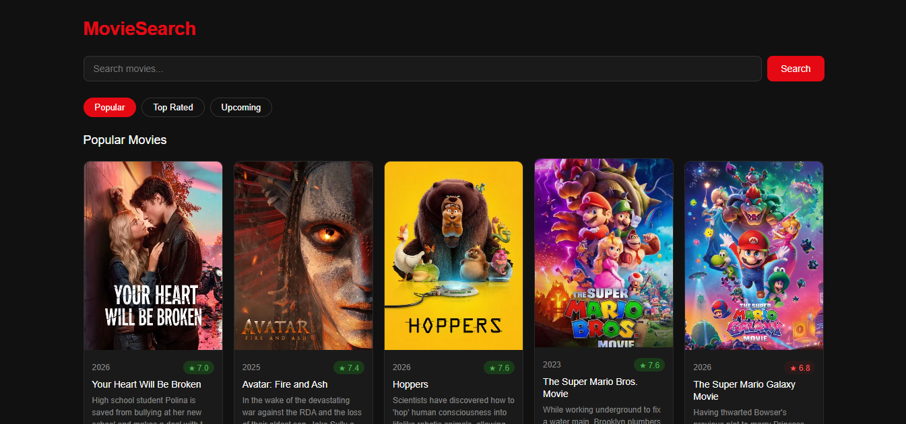

# MovieSearch App

A responsive movie search app built with React that fetches real-time data 
from the TMDB API. Browse popular, top rated, and upcoming movies or search 
any title instantly.

## Features

- Browse movies by Popular, Top Rated, and Upcoming categories
- Search any movie by title
- Movie cards with poster, rating, release year, and description
- Color coded rating badge (green = good, red = low)
- Responsive grid layout for all screen sizes
- Error handling for failed API requests

## Tech used

- React 18
- JavaScript (ES6+)
- TMDB API (The Movie Database)
- CSS3 (Flexbox, Grid)
- Vercel (deployment)

## Concepts learned

- React functional components
- useState and useEffect hooks
- Props and component reusability
- Async/await with fetch inside React
- Conditional rendering (loading, error, results)
- Environment variables with .env for API key security
- Component folder structure

## How to run locally

1. Clone the repo
```bash
   git clone https://github.com/YOUR_USERNAME/movie-search.git
   cd movie-search
```

2. Install dependencies
```bash
   npm install
```

3. Create a `.env` file in the root folder based on `.env.example`
REACT_APP_TMDB_KEY=your_tmdb_api_key_here

4. Get your free API key from [themoviedb.org](https://www.themoviedb.org)

5. Start the app
```bash
   npm start
```

## Environment variables

Create a `.env` file in the root of the project:
REACT_APP_TMDB_KEY=your_key_here

Never commit your `.env` file — it is already blocked by `.gitignore`.

## Live demo

[View live →](https://movie-search-ijj8v47wx-kjeeva151204-2481s-projects.vercel.app/)

## Screenshot



## Project structure
movie-search/
├── public/
├── src/
│   ├── components/
│   │   ├── SearchBar.js
│   │   ├── MovieCard.js
│   │   └── Loader.js
│   ├── App.js
│   ├── App.css
│   ├── index.js
│   └── index.css
├── .env               ← never uploaded
├── .env.example       ← uploaded (no real key)
├── .gitignore
└── README.md

## Attribution

This product uses the TMDB API but is not endorsed or certified by TMDB.

## Author

Your Name — [github.com/YOUR_USERNAME](https://github.com/YOUR_USERNAME)